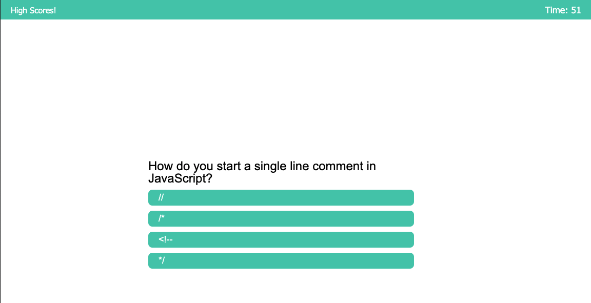
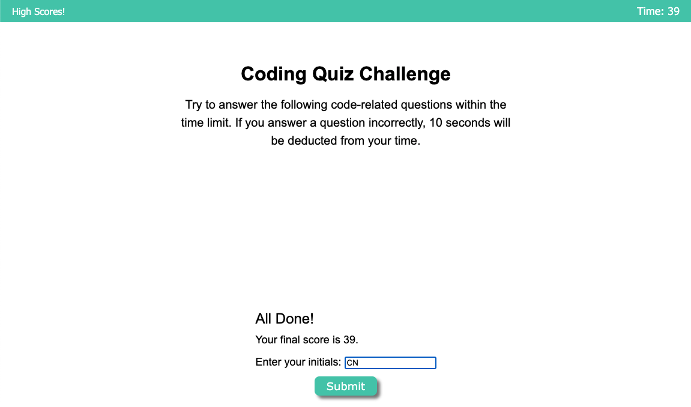
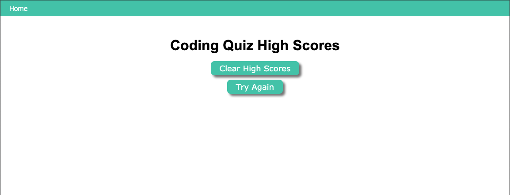

# javascript_quiz

A coding bootcamp homework assignment designed to practice manipulating DOM elements in JavaScript.

The user will answer a series of questions in under a minute. If the answer is correct, the button turns green. If the answer is wrong, the button turns red and 10 seconds is deducted from their time.

At the end, the user can enter their initials and have their high score captured on the high score page of the site. Unfortunately, I was not able to get that part to work.

<a href="https://calliebn.github.io/javascript_quiz/">Click here</a> to take the quiz.

## Technologies Used
* JavaScript
* HTML
* CSS

## Resources
I followed a video tutorial for the basic functionality of the quiz: https://www.youtube.com/watch?v=riDzcEQbX6k
